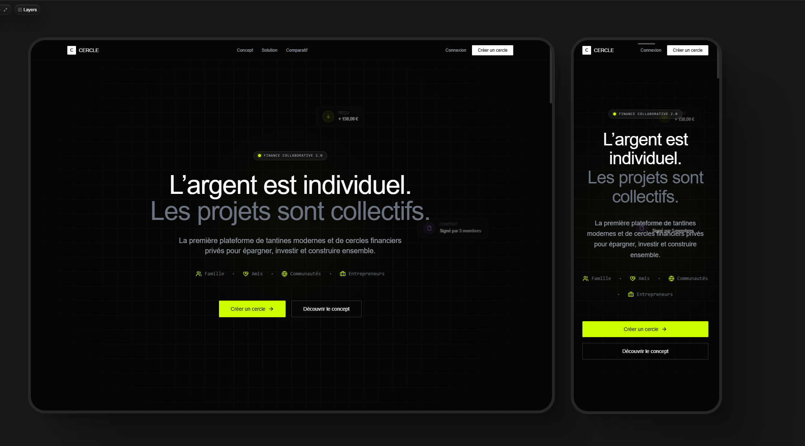

# le Cercle
Fintech Communautaire Le Cercle,  LE CERCLE est une plateforme de finance communautaire qui digitalise un système ancestral :
la tantine (épargne rotative), au sein de cercles financiers privés et de confiance.

# Demo

https://johntrumanburbank-afk.github.io/lecercle/

# CERCLE

> L’argent est individuel. Les projets sont collectifs.

**CERCLE** est une plateforme de **finance communautaire** qui digitalise un système ancestral :  
la **tantine** (épargne rotative), au sein de **cercles financiers privés et de confiance**.

L’objectif n’est pas de remplacer une banque,  
mais de fournir une **infrastructure numérique sécurisée** permettant à des groupes
(familles, amis, entrepreneurs, communautés) d’épargner, de décider et de construire ensemble.

---

## 🌍 Vision

La finance moderne est largement individuelle.  
Pourtant, de nombreux projets — immobiliers, entrepreneuriaux, familiaux — sont collectifs par nature.

**CERCLE** réconcilie :
- discipline financière,
- intelligence collective,
- transparence,
- et confiance communautaire.

---

## 🧩 Fonctionnalités clés

### 🔹 Cercles financiers privés
- Création de cercles (famille, amis, communautés, entrepreneurs)
- Invitation sécurisée des membres
- Gestion des rôles (organisateur, membre, observateur)

### 🔹 Tantine digitale
- Définition des règles dès la création :
  - montant de cotisation
  - durée
  - nombre de participants
  - ordre de perception (fixe, tirage, priorité)
- Historique complet des contributions
- Visibilité en temps réel sur les flux et les soldes

### 🔹 Décisions collectives
- Système de vote intégré
- Décisions traçables et horodatées
- Aucun mouvement de fonds sans validation du cercle

### 🔹 Sécurité & transparence
- Fonds cantonnés (séparation des comptes)
- Architecture bancaire sécurisée (via prestataires agréés)
- Journalisation complète des actions

---

## 🏗️ Cas d’usage

- Épargne familiale organisée
- Accès anticipé au capital via la tantine
- Financement de projets communs
- Investissement collectif **encadré** (immobilier, entreprises, actifs financiers)
- Cercles générationnels (transmission, éducation financière)

---

## ⚖️ Cadre & conformité

CERCLE :
- ❌ n’est pas une banque
- ❌ n’est pas un fonds d’investissement
- ❌ ne promet aucun rendement

CERCLE est :
- une **plateforme de coordination financière privée**
- un **outil de décision collective**
- une **infrastructure technique**, pas un gestionnaire d’actifs

Les décisions financières sont prises exclusivement par les membres des cercles.

---

## 🛠️ Stack technique (prévisionnelle)

> Cette section évoluera avec le projet.

- Frontend : React / Next.js
- Backend : Node.js / API sécurisée
- Authentification : OAuth / JWT
- Base de données : PostgreSQL
- Paiements : Prestataires agréés (PSP)
- Infrastructure : Cloud sécurisé
- Design system : UI orientée clarté & confiance

---

## 🚧 Statut du projet

🔧 **En cours de conception / prototypage**

- Recherche produit & UX
- Validation du cadre légal
- Définition de l’architecture technique
- Tests utilisateurs à venir

---

## 🤝 Contribuer

Les contributions sont les bienvenues :
- feedback produit
- UX / UI
- architecture technique
- questions réglementaires
- discussions stratégiques

👉 Ouvrez une issue ou une discussion.

---

## 📬 Contact

Projet initié par **Le Cercle**  
📩 Contact : à compléter  
🔗 LinkedIn / Site : à venir

---

> Construire seul est lent.  
> Construire ensemble change tout.

Réalisé par I.BERNARD AND IUT LYON 1 - STUDENTS
